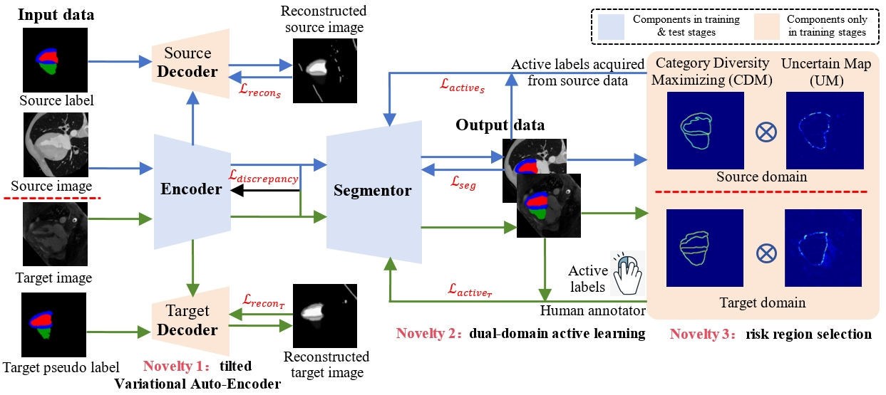

# cuADA: "Active Learning for Cross-Modality Cardiac Image Segmentation With Minimal Pixel-Level Annotation"


This repository is the official PyTorch implementation of cuADA for cross-modal cardiac segmentation.

<p align="center">
    <br>
    
    <br>
</p>

## You might also be interested in


## Quick Start!


## ToDo
- [ ] **Release Active Learning Strategy Code (Maybe two days after the article is accepted).**
- [ ] **Release Inference Code of cuADA, Model Weights, Data Links.**
- [ ] **Release Training Code for C02LGE.**
- [ ] **Release Training Code for CT2MR&MR2CT.**


## 引用
如果这个仓库对你有帮助，请考虑引用我们的工作:
```
```
