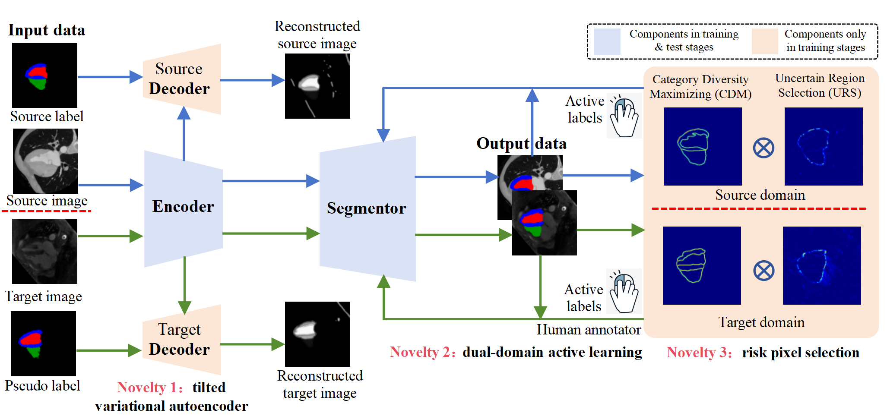

# cuADA: "Active learning for cross-modal cardiac segmentation with sparse annotation"


This repository is the official PyTorch implementation of cuADA for cross-modal cardiac segmentation.

<p align="center">
    <br>
    
    <br>
</p>

## You might also be interested in
[Multi-task oriented diffusion model for mortality prediction in shock patients with incomplete data](https://doi.org/10.1016/j.inffus.2023.102207)

## Quick Start!


## ToDo
- [x] **Release Active Learning Strategy Code (maybe two days after the paper is accepted).**
- [ ] **Release Inference Code of cuADA, Model Weights, Data Links.**
- [ ] **Release Training Code for C02LGE.**
- [ ] **Release Training Code for CT2MR&MR2CT.**


## Citation
If this repository is helpful to you, please consider citing our work:
```
@article{CHEN2025111403,
  author = {Zihang Chen and Weijie Zhao and Jingyang Liu and Puguang Xie and Siyu Hou and Yongjian Nian and Xiaochao Yang and Ruiyan Ma and Haiyan Ding and Jingjing Xiao},
  title = {Active learning for cross-modal cardiac segmentation with sparse annotation},
  journal = {Pattern Recognition},
  volume = {162},
  pages = {111403},
  year = {2025},
  issn = {0031-3203},
  doi = {https://doi.org/10.1016/j.patcog.2025.111403},
  url = {https://www.sciencedirect.com/science/article/pii/S0031320325000639}
}
```
